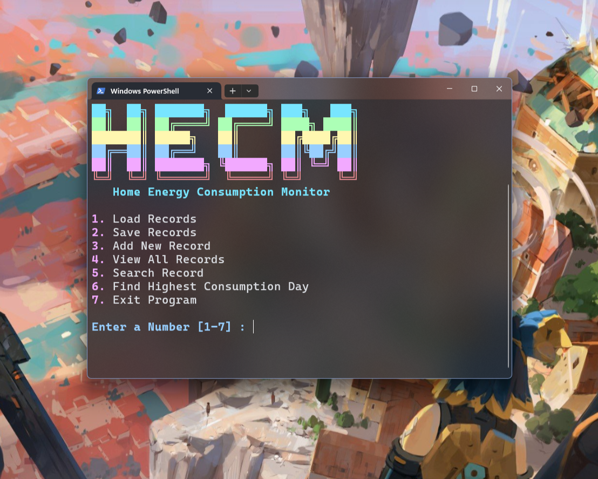

# Home Energy Consumption Monitor

A C-based command-line application to track and monitor home energy consumption. This tool allows users to record daily energy usage, breakdown consumption by appliance (HVAC, Lighting, Water Heater), and analyze the data to find peak consumption days.

## Screenshot



## 🚀 Features

- **Add Daily Records**: Input date, total kWh, and specific appliance consumption.
- **View All Records**: Display a list of all stored energy usage data.
- **Search Functionality**: Find specific records by date (YYYY-MM-DD).
- **Analysis**: Automatically identify the day with the highest energy consumption.
- **File Persistence**: Load and save records to a local file (`energy.txt`), ensuring data is preserved between sessions.
- **Colorful Interface**: User-friendly CLI with color-coded details for better readability.

## 🛠️ Usage

### Modifying/Editing the Code in IDEs

Depending on the IDE you use, there are small differences when opening and editing the code:

- **VS Code**  
  When opening the code in VS Code, make sure to open it with **DOS (CP437) encoding**. This ensures all characters display correctly, especially if the code contains special ASCII characters. To do this:

  1. Open the file in VS Code.
  2. Click the **UTF-8** label in the bottom-right corner of VS Code.
  3. Select **Reopen with Encoding → DOS (CP437)**.

- **Code::Blocks**  
  No special encoding is needed. Simply open the project and edit the files normally.

### Compilation

You can compile the program using a C compiler like `gcc`.

```bash
gcc hecm.c -o hecm.exe
```

### Running the Program

Run the executable to start the interactive menu.

```powershell
./hecm.exe
```

### Menu Options

1. **Load Records**: Loads existing data from `energy.txt`.
2. **Save Records**: Saves current data to `energy.txt`.
3. **Add New Record**: Prompts for Date, Total kWh, and breakdown for HVAC, Lighting, and Water Heater.
4. **View All Records**: Lists all records currently in memory.
5. **Search Record**: Search for a specific day's usage.
6. **Find Highest Consumption Day**: Displays the record with the peak energy usage.
7. **Exit Program**: Closes the application.

## 📂 File Structure

- `hecm.c`: The main source code for the application.
- `energy.txt`: Data file where records are stored (created after saving).
- `readme.md`: Project documentation.

## 📝 Data Format

The application stores data in `energy.txt` in the following CSV-like format:

```
Date,Total_kWh,HVAC_kWh,Lighting_kWh,WaterHeater_kWh
```

Example:

```
2023-10-27,45.50,20.00,10.00,15.50
```

## 👨‍💻 Author

Created by Shafin.
